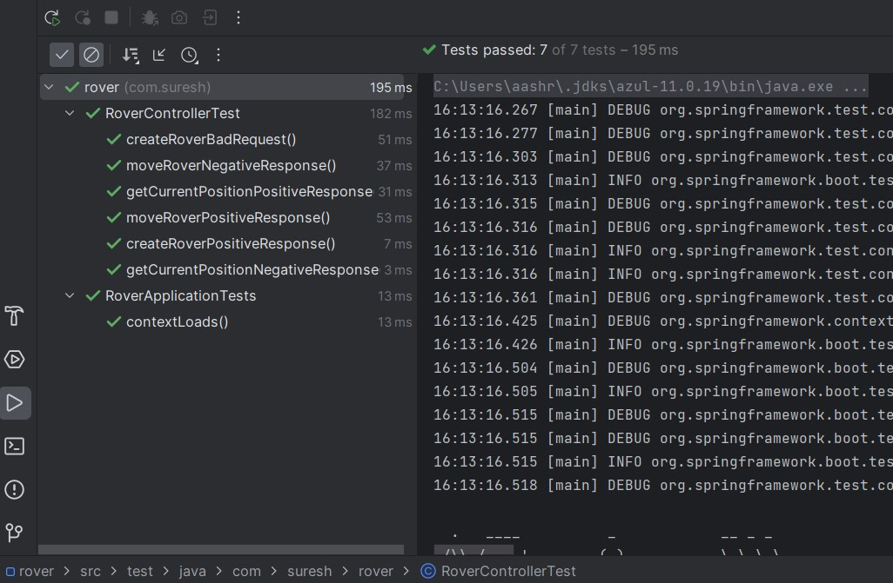

## Getting Started

This backend version of the Mars Rover application provides a REST API endpoints.

## Running User API locally
### With maven command line (Set JAVA_HOME if needed)
```
git clone https://github.com/sureshchellaboyina/rover.git
cd rover
./mvnw spring-boot:run
```

### API Response

#### Create Rover
#### Example:
POST http://localhost:8080/rover

data '3,4,E'
```
New Rover: R1, Coordinate: 3,4, Direction: East
```
ErrorResponse, if there are no rovers
#### Example:
POST http://localhost:8080/rover

data '3,4,X'
```
Invalid direction: X
```


#### Current Position
GET http://localhost:8080/rover/<rover-name>/position
#### Example:
GET http://localhost:8080/rover/R1/position
```
Rover: R1, Current Position: Coordinate: 3,4, Direction: East
```
ErrorResponse, if there are no rovers
#### Example:
GET http://localhost:8080/rover/R6/position
```
Rover not found: R6
```

#### Move Rover
POST http://localhost:8080/rover/<rover-name>/move
#### Example:
POST http://localhost:8080/rover/R1/move
```
Rover: R1, Final Position: Coordinate: 5,2, Direction: South
```
ErrorResponse, if there are no rovers
#### Example:
GET http://localhost:8080/rover/R6/move
```
Rover not found: R6
```

### Test Results

